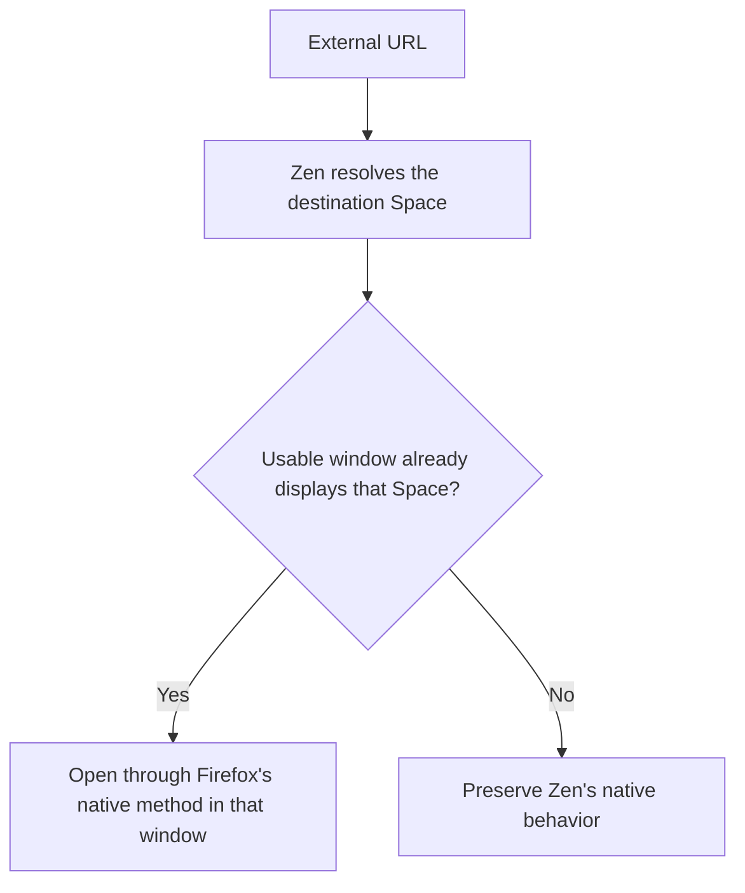

# Zen Space Router

Zen Space Router is an experimental privileged extension for
[Zen Browser](https://zen-browser.app/). It makes external links open in the
existing Zen window already displaying the Space selected by Zen's native
Space Routing.

Without the extension, Zen may select an arbitrary browser window first and
then switch that window to the routed Space. This is especially visible with
several windows across multiple displays.

## Behavior



Zen remains the source of truth for URL rules and the destination Space. The
extension only chooses the first eligible window displaying that Space in
Firefox's window order, before the tab is created.

A candidate must be an open browser window with Zen Workspaces enabled.
Closed and non-browser windows are ignored. Native behavior is preserved for
`Most recent Space`, private browsing, missing matches, and invalid input.

The extension focuses the selected window, but does not move tabs, position
windows, restore sessions, manage displays, or maintain separate routing
rules.

## Compatibility

Initially validated with Zen Browser 1.21.16b on macOS. It relies on
internal Zen and Firefox APIs and may require updates when Zen changes them.

## Temporary installation

This is the safest option for testing in an existing profile:

1. Open `about:config`.
2. Set `extensions.experiments.enabled` to `true`.
3. Open `about:debugging#/runtime/this-firefox`.
4. Choose **Load Temporary Add-on** and select `src/manifest.json`.

The extension disappears when Zen exits. Reset
`extensions.experiments.enabled` to `false` after testing.

## Persistent installation

Persistent installation is possible, but it weakens extension security for the
entire Zen profile. This project does not distribute a prebuilt XPI: inspect
the source and build the file locally before installing it.

1. Clone the repository and enter it:

   ```sh
   git clone https://github.com/nrako/zen-space-router.git
   cd zen-space-router
   ```

2. Test the source and build the XPI:

   ```sh
   npm test
   npm run build
   ```

   The generated file is `dist/zen-space-router.xpi`. The `dist/`
   directory is ignored by Git.

3. In Zen, open `about:config` and set:

   ```text
   extensions.experiments.enabled = true
   xpinstall.signatures.required = false
   ```

4. Open `about:addons`.
5. Select **Extensions**, open the gear menu, then choose
   **Install Add-on From File…**.
6. Select the locally generated `dist/zen-space-router.xpi` and confirm the
   installation.
7. Verify that **Zen Space Router (Experimental)** appears and is enabled.
8. Restart Zen once and open another external link to confirm that the
   persistent installation loads correctly.

Keep both preferences in place while the unsigned privileged extension is
installed.

To update it, pull the source, run the tests and build again, then install the
new XPI through the same `about:addons` menu.

To uninstall it:

1. Remove **Zen Space Router (Experimental)** from `about:addons`.
2. Open `about:config`.
3. Reset `extensions.experiments.enabled` and
   `xpinstall.signatures.required` to their defaults.

Mozilla's ordinary AMO signing service cannot sign out-of-tree privileged
extensions that define `experiment_apis`. A normally signed release therefore
requires the behavior to be integrated upstream into Zen.

## Space Routing setup

Configure routes in Zen itself. For example, route YouTube to a Videos Space:

```regex
^https?:\/\/(?:[^\/]+\.)?youtube\.com(?:\/|$)|^https?:\/\/youtu\.be(?:\/|$)
```

Set **Default route for external links** to the main Space. No negative fallback
regex is necessary.

## Development

```sh
npm test
npm run build
```

The build produces `dist/zen-space-router.xpi` using the system `zip`
command. The project has no package dependencies.

See [the feasibility record](docs/feasibility.md) for the validated browser
boundary and [Zen issue #15209](https://github.com/zen-browser/desktop/issues/15209)
for the upstream report. Its technical context is mirrored in
[docs/upstream-issue.md](docs/upstream-issue.md).

## Security and privacy

The extension executes with browser-level privileges. Inspect the source before
installing it. It does not collect data, make network requests, or log and
persist routed URLs. It declares private browsing unsupported.

Zen Space Router is independent and is not affiliated with Zen Browser or
Mozilla.

## License

[Mozilla Public License 2.0](LICENSE)
